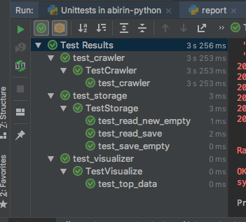

# PYTHON-abirin

report.py - main file that runs the program:
python3 report.py

crawler.py - scrapy's crawler that collects data

storage.py - methods work with json to save/read from file

visualizer.py - show results: console print for top authors/articles, bar chart for tags

articles_test.txt - test data set

articles.txt - default filename to store loaded data

tests ran:
